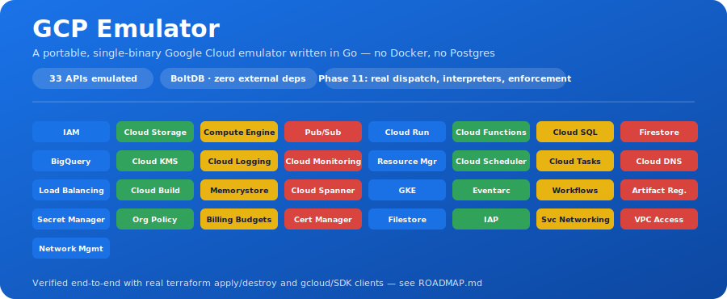

<p align="center">
  
</p>

# GCP Emulator

A local Google Cloud Platform emulator written in Go. It exposes REST APIs
compatible with `storage.googleapis.com`, `compute.googleapis.com`, and
`iam.googleapis.com`, persists everything in a single embedded file
(BoltDB), and ships with a lightweight web console (a thin clone of the
Google Cloud Console) for inspecting resources.

Goal: a portable binary (no Docker, no Postgres, nothing external
required) that runs the same way on Windows, Linux, or macOS, against
which you can point the real `gcloud` CLI and the official Google SDKs by
overriding their API endpoints to `localhost`.

## Current status

Implemented (functional subset, not exhaustive):

- **IAM**: create/list/get/delete service accounts, get/set project-level
  IAM policy, list of basic predefined roles.
- **Cloud Storage (GCS)**: create/list/get/delete buckets; upload
  (`uploadType=media`), list, download (`alt=media`), and delete objects.
- **Compute Engine**:
  - Instances: create/list/get/delete, start/stop, with real
    `disks[]` and `networkInterfaces[]` (boot disks are created
    automatically from `initializeParams`, network/subnetwork references
    are normalized, and fake internal/external IPs are assigned).
  - Networking: `compute.networks` (VPC, global), `compute.subnetworks`
    (regional), `compute.firewalls` (global).
  - `compute.disks` (zonal), `compute.images` (static read-only catalog:
    debian-12, debian-11, ubuntu-2204-lts, cos-stable).
  - Static zones/machine types, singular `zones/{zone}` and
    `regions/{region}` lookups, and the `Operation` resource (synchronous)
    for compatibility with the real `gcloud`/Terraform flow.
- **Pub/Sub**: topics and subscriptions (CRUD), `topics.publish`,
  `subscriptions.pull`, `subscriptions.acknowledge`. Message delivery is
  in-memory (not persisted), enough for typical create/publish/consume
  flows.
- **Secret Manager**: secrets (CRUD), `secrets.addVersion`,
  `versions.access` (including the `latest` alias), `versions.destroy`.
  Payloads are stored base64-encoded, same as the real API.
- **Artifact Registry**: repositories (CRUD) under
  `projects/{p}/locations/{l}/repositories`, with create/delete returning
  a `google.longrunning.Operation`-shaped response (always resolved,
  `done: true`).
- **Web console** (`web/console`): minimal UI to view and manage buckets,
  instances, and service accounts.
- Verified end-to-end with a real `terraform apply`/`destroy` against
  `google_compute_network` + `google_compute_instance` (boot disk +
  network interface) — applies and destroys cleanly, no provider patches
  needed.

Roadmap / what's next: advanced IAM (custom roles, SA keys,
resource-level bindings), Cloud Run, Cloud Functions, Cloud SQL,
Firestore, BigQuery, and observability stubs (KMS, Logging, Monitoring).
See [ROADMAP.md](ROADMAP.md) for the full phased plan. The architecture
(`internal/services/<service>`) is designed so new services can be added
without touching existing ones.

## Project structure

```
cmd/server/main.go          entry point, wires up the HTTP server
internal/storage/           embedded persistence (BoltDB)
internal/server/            router, middlewares, JSON/error helpers, Operations
internal/services/iam/      IAM emulation
internal/services/gcs/      Cloud Storage emulation
internal/services/compute/  Compute Engine emulation (instances, networks,
                             subnetworks, firewalls, images, disks)
internal/services/pubsub/         Pub/Sub emulation (topics, subscriptions, publish/pull/ack)
internal/services/secretmanager/  Secret Manager emulation (secrets, versions)
internal/services/artifactregistry/ Artifact Registry emulation (repositories)
web/console/                static frontend (HTML/CSS/JS, no build step)
scripts/                    scripts to point the gcloud CLI at the emulator
data/                       runtime embedded data file (gitignored)
```

## Requirements

- Go 1.22+ (uses `net/http` with method/pattern routing, no frameworks).
- gcloud CLI / Terraform (optional, to exercise real commands against the
  emulator).

> Note: this repo does not bundle the Go toolchain. If you don't have it
> installed, get it from https://go.dev/dl/ (or `winget install GoLang.Go`
> on Windows, `brew install go` on macOS, `apt install golang-go` on
> Linux).

## Running the emulator

```bash
cd gcp-emulator
go mod tidy        # downloads the single external dependency: go.etcd.io/bbolt
go run ./cmd/server
```

By default it listens on `:8443`, persists to `data/emulator.db`, and
serves the web console at `/`. It can be configured with flags or
environment variables:

```bash
go run ./cmd/server -addr :9000 -db data/other.db -web web/console
# or
EMULATOR_ADDR=:9000 EMULATOR_DB=data/other.db go run ./cmd/server
```

To produce a portable binary:

```bash
go build -o bin/gcp-emulator ./cmd/server
./bin/gcp-emulator
```

Open `http://localhost:8443` for the web console.

## Running with Docker (recommended: portable, no Go install needed)

```bash
docker compose up --build -d
# or, without compose:
docker build -t gcp-emulator .
docker run --rm -p 8443:8443 -v emulator-data:/data gcp-emulator
```

The image is multi-stage (built with `golang:1.22-alpine`, runtime on
plain `alpine`, no toolchain in the final image) and runs as a non-root
user. Data persists in the `emulator-data` volume (`/data/emulator.db`
inside the container), so it survives `docker compose down` /
container recreation (but not `docker compose down -v`, which also wipes
the volume).

## Using the gcloud CLI against the emulator

```bash
# Linux/macOS
./scripts/configure-gcloud.sh http://localhost:8443

# Windows (PowerShell)
.\scripts\configure-gcloud.ps1 http://localhost:8443
```

This configures `api_endpoint_overrides` for storage/compute/iam pointing
at the emulator (storage and iam use a slightly different URL shape
because their clients build the path differently: storage and compute
need the `v1/` in the override, iam appends it itself). gcloud also
requires an "active" account; if you already have a logged-in session in
your `default` configuration, it's enough to reuse it (the script does
this automatically) — the emulator doesn't validate the token. Then, for
example:

```bash
gcloud storage buckets create gs://my-bucket --project=demo-project
gcloud storage buckets list
gcloud compute instances create my-vm --zone=us-central1-a --project=demo-project
gcloud compute instances list --zones=us-central1-a --project=demo-project
gcloud iam service-accounts create demo-sa --display-name="Demo SA" --project=demo-project
gcloud iam service-accounts list --project=demo-project
```

Tip: use a separate `gcloud configuration` (`gcloud config configurations
create emulator-test`) so you don't overwrite your real configuration
while testing. To go back to real GCP, create/activate another
configuration:

```bash
gcloud config configurations create real-gcp
gcloud config configurations activate real-gcp
```

## Using Terraform against the emulator

Point the `google` provider's custom endpoints at the emulator and use a
dummy static access token to skip real OAuth:

```hcl
provider "google" {
  project                 = "demo-project"
  region                  = "us-central1"
  zone                    = "us-central1-a"
  access_token            = "dummy-token"
  storage_custom_endpoint = "http://localhost:8443/storage/v1/"
  compute_custom_endpoint = "http://localhost:8443/compute/v1/"
}

resource "google_compute_network" "vpc" {
  name                    = "tf-vpc"
  auto_create_subnetworks = true
}

resource "google_compute_instance" "vm" {
  name         = "tf-vm"
  machine_type = "e2-medium"
  zone         = "us-central1-a"

  boot_disk {
    initialize_params {
      image = "debian-cloud/debian-12"
      size  = 20
    }
  }

  network_interface {
    network = google_compute_network.vpc.name
    access_config {}
  }
}
```

`terraform apply` / `terraform destroy` work against this without any
provider patches.

## Trying it without gcloud (curl)

```bash
curl -X POST localhost:8443/storage/v1/b -d '{"name":"my-bucket"}'
curl localhost:8443/storage/v1/b

curl -X POST "localhost:8443/upload/storage/v1/b/my-bucket/o?name=hello.txt" \
  -H "Content-Type: text/plain" --data-binary "hello world"
curl "localhost:8443/storage/v1/b/my-bucket/o/hello.txt?alt=media"
```

## Design

- **Portability**: a single Go binary plus a single BoltDB file. No
  Docker, no external database, no required environment variables.
- **API compatibility**: HTTP routes replicate the real Google API paths
  (`/storage/v1/b/...`, `/compute/v1/projects/.../zones/...`) so that
  `api_endpoint_overrides` in gcloud, the official SDKs, and Terraform's
  `google` provider can point straight at the emulator without patches.
  This includes faithfully reproducing subtle response-shape details the
  real clients rely on — e.g. numeric `id` fields serialized as strings,
  and objects like `metadata`/`tags`/`scheduling` on instances always
  being present and non-null, since some clients dereference them
  without a nil check.
- **Extensible**: each service lives in `internal/services/<name>` with
  its own `Register(mux)`; adding a new service doesn't touch existing
  ones.

## Roadmap

See [ROADMAP.md](ROADMAP.md) for the full list of planned services and
resources, grouped into phases by dependency and value.
